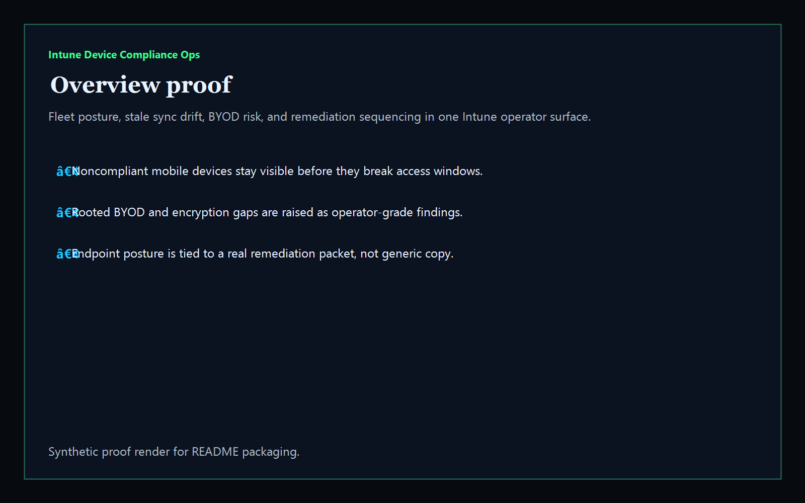
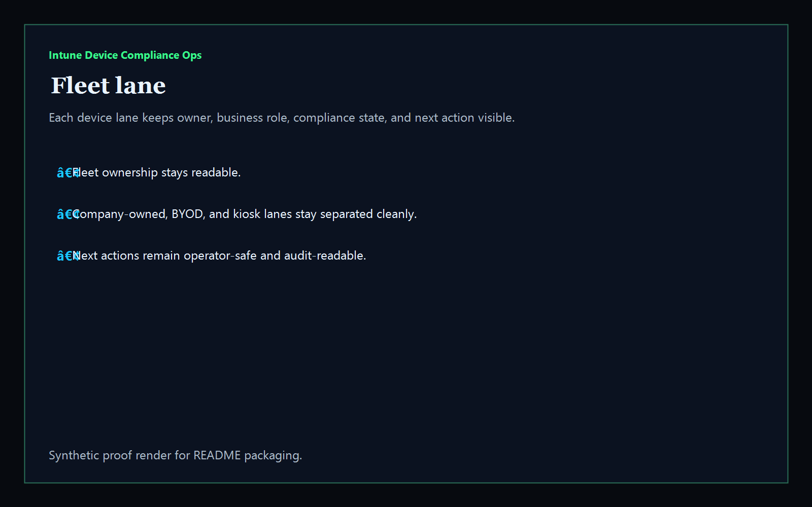
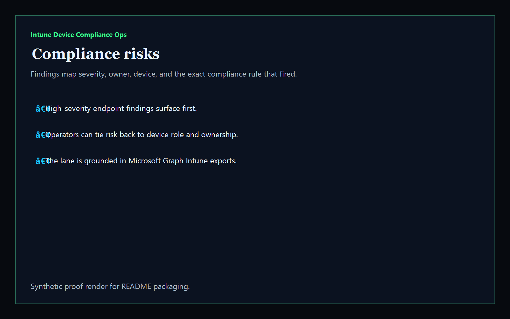
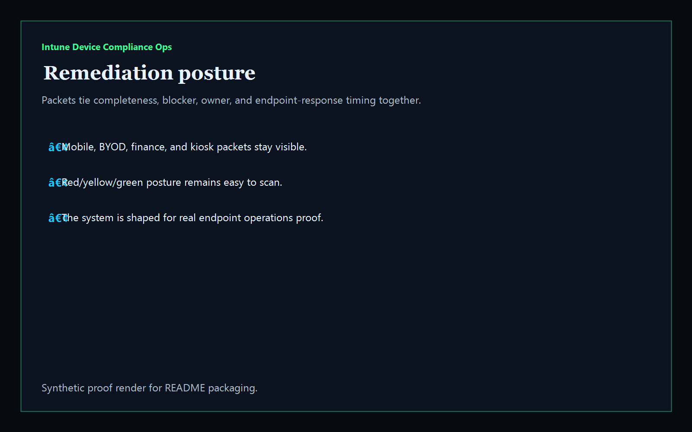

# Intune Device Compliance Ops

[](https://github.com/mizcausevic-dev/intune-device-compliance-ops/actions/workflows/ci.yml)
[](./LICENSE)
[](https://github.com/mizcausevic-dev/intune-device-compliance-ops/actions/workflows/pages.yml)

Operator control plane for Microsoft Intune device compliance, stale sync risk, BYOD posture, encryption drift, and remediation readiness across endpoint fleets.

## Why this exists

- Endpoint operations teams need more than a raw `managedDevices` export when audits, rollout windows, and user-impacting compliance failures collide.
- Intune operators need one surface that shows fleet risk, stale check-ins, jailbreak/root posture, missing encryption, and remediation sequencing.
- Recruiters and buyers looking for `Azure / Microsoft 365 / Entra / Intune` proof should see a real endpoint-compliance dashboard, not a generic cloud keyword project.
- Device compliance becomes more valuable when it is packaged as an operator system for security, platform, and IT operations teams.

## Why this matters (KG Embedded tie-back)

This repo demonstrates the endpoint-compliance control-plane primitive for Microsoft tenant operations: fleet posture, stale device drift, encryption gaps, BYOD review, and remediation packets in one operator surface. Kinetic Gain Embedded extends this pattern into productized in-app dashboards where compliance, security, and device signals need to stay visible without exposing raw admin backends or tenant data. See [kineticgain.com/embedded](https://kineticgain.com/embedded).

## What it shows

- fleet-lane visibility for active Intune device cohorts and ownership posture
- compliance-risk detection for noncompliant, jailbroken, unencrypted, stale, and orphaned devices
- remediation packets for executive laptops, BYOD Android, shared kiosks, and stale macOS devices
- offline-safe analysis of captured Microsoft Graph `deviceManagement/managedDevices` exports
- recruiter-facing Microsoft endpoint operations proof that composes with Entra governance

## Routes

- `/`
- `/fleet-lane`
- `/compliance-risks`
- `/remediation-posture`
- `/verification`
- `/docs`

## API

- `/api/dashboard/summary`
- `/api/fleet-lane`
- `/api/compliance-risks`
- `/api/remediation-posture`
- `/api/verification`
- `/api/sample`

## Screenshots






## CLI

```powershell
npx intune-device-compliance <export.json> `
    --format json|markdown|summary `
    --now 2026-05-27T08:00:00Z `
    --stale-after-days 14 `
    --fail-on-high `
    --out report.md
```

Input is any of:
- a single `managedDevice` object
- an array of devices
- a Microsoft Graph collection envelope: `{ "value": [ ... ] }`

## Local Development

```powershell
cd intune-device-compliance-ops
npm install
npm run dev
```

Open:
- [http://127.0.0.1:5512/](http://127.0.0.1:5512/)
- [http://127.0.0.1:5512/fleet-lane](http://127.0.0.1:5512/fleet-lane)
- [http://127.0.0.1:5512/compliance-risks](http://127.0.0.1:5512/compliance-risks)
- [http://127.0.0.1:5512/remediation-posture](http://127.0.0.1:5512/remediation-posture)
- [http://127.0.0.1:5512/verification](http://127.0.0.1:5512/verification)

## Validation

- `npm run lint`
- `npm run typecheck`
- `npm run coverage`
- `npm run build`
- `npm run demo`
- `npm run smoke`
- `npm run prerender`
- `npm run render:assets`

## Production status

| Aspect | Status |
|--------|--------|
| CI | Node 20 + 22 matrix — lint · typecheck · coverage · build · demo · smoke · `npm audit` |
| License | [AGPL-3.0-or-later](./LICENSE) |
| Deploy | Static prerender -> **https://intune.kineticgain.com/** |
| Data posture | Synthetic sample data only; no tenant credentials or live Graph tokens |

## Docs

- [Architecture](./docs/architecture.md)
- [Origin](./docs/ORIGIN.md)
- [Kinetic Gain Embedded tie-back](./docs/KINETIC_GAIN_EMBEDDED.md)
- [Changelog](./CHANGELOG.md)
